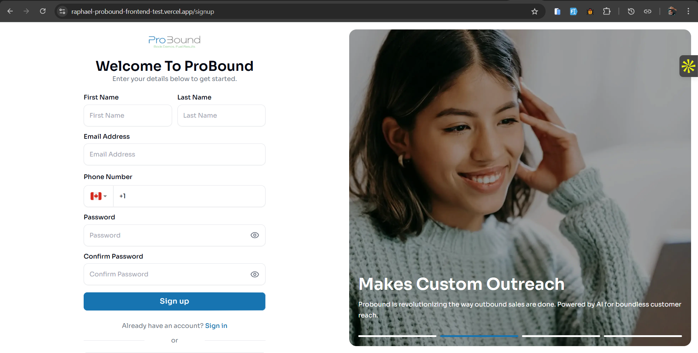
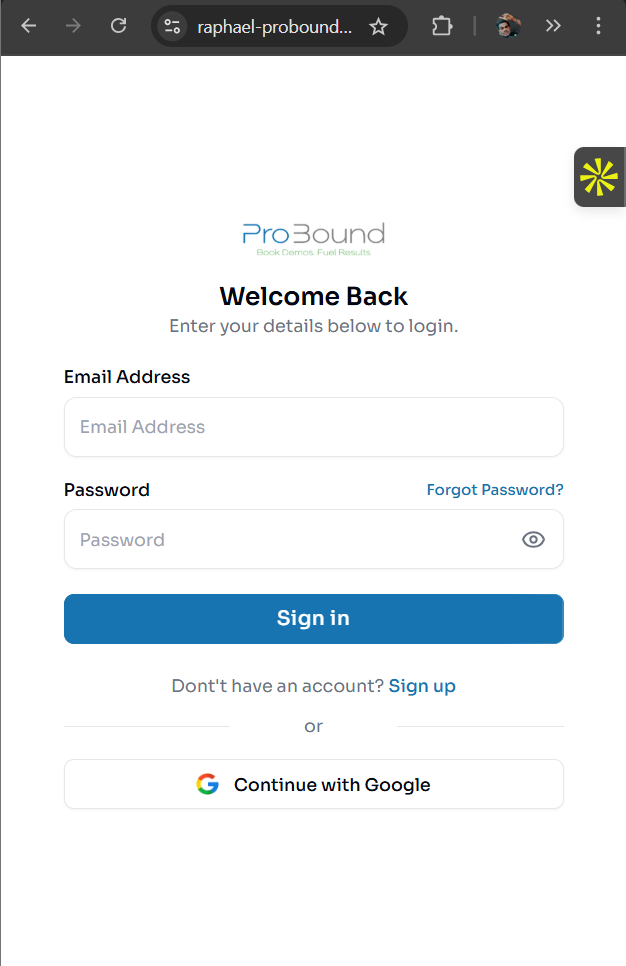
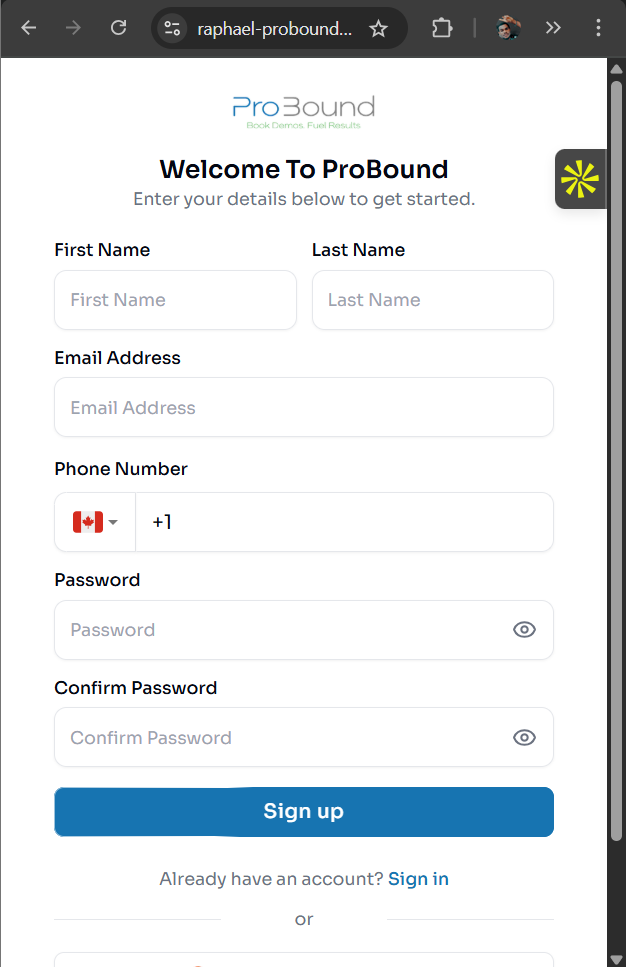
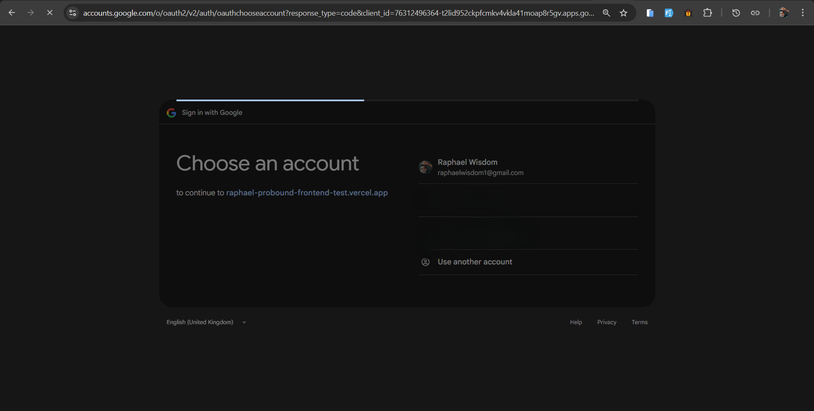
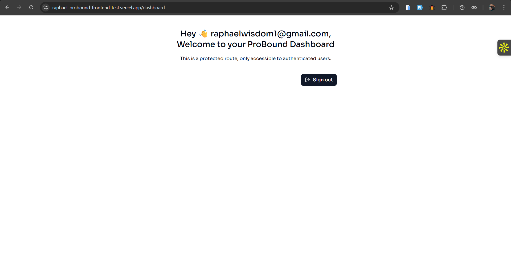

# ProBound Frontend Test

This project is a modern authentication flow UI for ProBound, built with Next.js. It features:

- **Sign In** and **Sign Up** forms with validation
- **Google OAuth** integration
- **Responsive design** for desktop and mobile
- **Protected dashboard** for authenticated users

## Screenshots of Chosen Screens

| Screenshot | Description |
|------------|-------------|
|  | Desktop Sign In page |
|  | Sign In validation errors |
|  | Desktop Sign Up page |
|  | Sign Up validation errors |
|  | Mobile Sign In page |
|  | Mobile Sign Up page |
|  | Google OAuth account selection |
|  | Authenticated dashboard view |

---

## Packages Used

Based on the UI and Next.js conventions, the following packages are likely used:

- **next** – React framework for SSR/SSG
- **react** & **react-dom** – Core React libraries
- **next-auth** – Authentication (Credentials & Google OAuth)
- **@hookform/resolvers** & **react-hook-form** – Form state management and validation
- **zod** – Schema validation for forms
- **tailwindcss** – For Styling
- **lucide-react** – For icons (eyeIcon, etc.)
- **shadcn** – For UI components
- **motion** – For Components Animations
- **husky** – For Git hooks pre-commit checks
- **lint-stage** – For Running linters on staged files
- **Prettier** - For Code formatting
- **react-international-phone** – For International phone number input component
- **@commitlint/cli** – Lints commit messages for conventional format
- **@commitlint/config-conventional** – Conventional commit rules for commitlint

---

## Setup & Run Instructions

1. **Clone the repository:**
   ```bash
   git clone <repo-url>
   cd raphael-probound-frontend-test
   ```

2. **Install dependencies:**
   ```bash
   npm install
   # or
   pnpm install
   # or
   yarn install
   # or
   bun install
   ```

3. **Configure environment variables:**
   - Copy `.env.example` to `.env.local` (if available).
   - Set up your Google OAuth credentials and any other required environment variables.

4. **Run the development server:**
   ```bash
   npm run dev
   # or
   pnpm dev
   # or
   yarn dev
   # or
   bun dev
   ```

5. **Open the app:**
   - Open [http://localhost:3000](http://localhost:3000) with your browser to see the result.

---